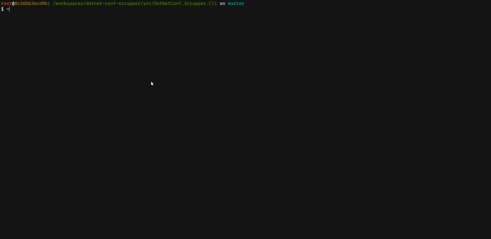

# dotnetconf-scrapper-cli


A demo to show System.CommandLine and Spectre.Console combined to build rapid and clean CLI.

Demo: Scrapes <https://mod-dotnet-bot.net/gallery/> and allows to manipulate downloaded info. For more details `dotnet run -- -h`.

```bash
➜ dotnet list ./src/DotNetConf.Scrapper.Cli package --include-transitive

Project 'DotNetConf.Scrapper.Cli' has the following package references
   [net5.0]: 
   Top-level Package                 Requested             Resolved           
   > HtmlAgilityPack                 1.11.28               1.11.28            
   > Spectre.Console.ImageSharp      0.31.0                0.31.0             
   > System.CommandLine              2.0.0-beta1.20574.7   2.0.0-beta1.20574.7

   Transitive Package          Resolved
   > Microsoft.CSharp          4.4.1   
   > SixLabors.ImageSharp      1.0.2   
   > Spectre.Console           0.31.0  
   > System.Memory             4.5.4   
   > Wcwidth                   0.2.0   
```

